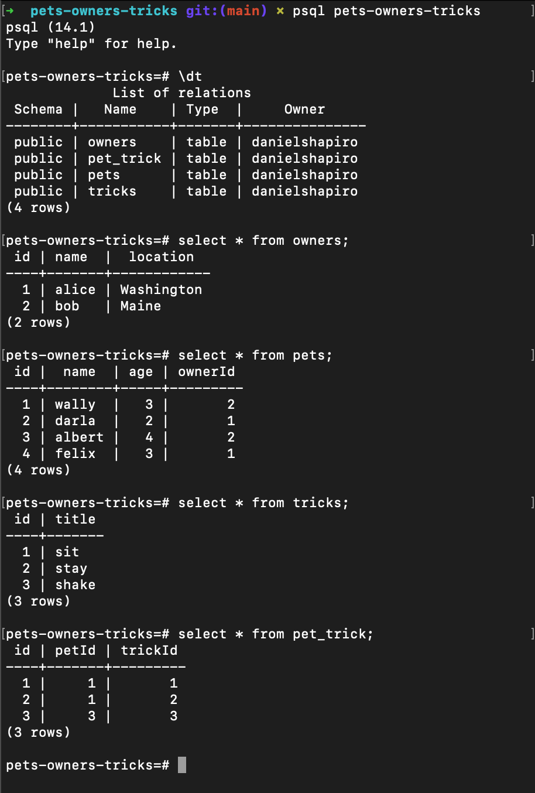

# PosgreSQL Tutorial

This tutorial will walk you through setting up a postgres db instance, connecting to the db, seeding from a `setup.sql` file, and running predetermined queries against db instance to learn a bit more about SQL syntax

## How to get started

Clone this repo, then issue the following commands to initialize your db instance:

`$ dropdb pets-owners-tricks` (optional, if database already exists)

`$ createdb pets-owners-tricks`

`$ psql pets-owners-tricks`

Once you've successfully connected to your db instance with `psql`, you'll be able to seed your database using the `setup.sql` file enclosed (your prompt and command will look similar to the below example):

`psql (14.1)`  
`Type "help" for help.`  
`pets-owners-tricks=#`

Run the following command from the `pets-owners-tricks=#` prompt to seed your database:

`\i ./setup.sql`

Verify your database has been seeded successfully by running the following commands and expecting the following output:

Once your database has been succesfully seeded, try running some of the pre-built queries from `queries.sql`, either via `\i queries.sql` or by inputting individual commands into the `psql` prompt directly!

## Advice

Use the `assets/database-schema` image file to visualize the tables as you work through the SQL queries and draw the connections that statements like `JOIN` make across tables, or the assertion that a through table instance makes by associating its separate IDs to a unique record for many:many relationships, as opposed to the 1:many relationship an owner holds with their pets.

Spend a bit of time with these through table relationships and try to "read between the lines" to understand what these associations mean in plain business logic: for example, the `pet_trick` table associates pets and tricks, so we can read an individual record of `petId=1, trickId=2` as <em>wally knows how to 'stay'</em>!

## Relationships

- `1:many`: owners have many pets, each pet belongs to a single owner
- `many:many`: pets know many tricks, and each trick may belong to all or no pets
